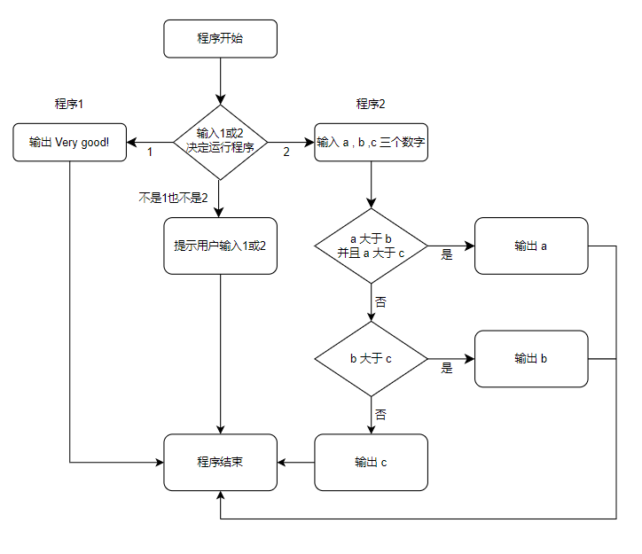

# C 语言实验 1 - C语言程序初步

## （一）实验目的
1. 熟悉C语言环境，掌握运行一个C语言程序的过程。
2. 掌握C语言程序的结构和书写格式。
3. 通过运行简单的C程序，初步了解C源程序的特点。

## （二）实验内容和要求
1. 编写一个C程序，输出以下信息:
    ```
    *****************************
         Very good!
    ******************************
    ```
2. 编写一个C程序，输入a、b、c 3个值，输出其中最大者。

### 实验要求：
1. 记下在调试过程中所发现的错误、系统给出的出错信息和对策。分析讨论对策成功或失败的原因；
2. 总结C程序的结构和书写规则。
3. 总结运行一个C程序的步骤。

## （三）	主要仪器设备
仪器：计算机

实验环境：Windows 10

## （四）	实验原理


## （五）	源程序
见 [main.c](main.c)

## （六）	实验步骤与调试
1. 想出实现三个取最大的逻辑，并写出草稿。
2. 发现了`printf`完`scanf`会出现奇怪的bug。

应有行为

    Clang Experiment-1
    Choose the programme you want to run (1 or 2)
    1
    
实际行为

    1
    Clang Experiment-1
    Choose the programme you want to run (1 or 2)
    
3. `printf`需要等换行才会从缓存区输出。 因此需要自行使用`fflush(stdout);`输出。
4. 加入了 `setbuf(stdout, NULL);` 这段代码禁用缓存区

## （七） 实验结果与分析
1. 输入
    ```
    1
    ```
    输出
    ```
    Clang Experiment-1
    Choose the programme you want to run (1 or 2)
    ******************************
         Very good!
    ******************************
    ```
    ***
2. 输入
    ```
    2
    2,6,3
    ```
   输出
    ```
    Clang Experiment-1
    Choose the programme you want to run (1 or 2)
    Max value: 6
    ```
    ***
3. 输入
    ```
    2
    8,6,2
    ```
   输出
    ```
    Clang Experiment-1
    Choose the programme you want to run (1 or 2)
    Max value: 8
    ```
    ***
4. 输入
    ```
    2
    3,4,9
    ```
   输出
    ```
    Clang Experiment-1
    Choose the programme you want to run (1 or 2)
    Max value: 9
    ```
    ***
5. 输入
    ```
    2
    9,4,9
    ```
   输出
    ```
    Clang Experiment-1
    Choose the programme you want to run (1 or 2)
    Max value: 9
    ```
    ***

第一项中，程序能够正确输出指定字符串

第二项中，经验证三个数字分别为最大，均取得正确输出，并且相同输入时也能正确输出最大值。
