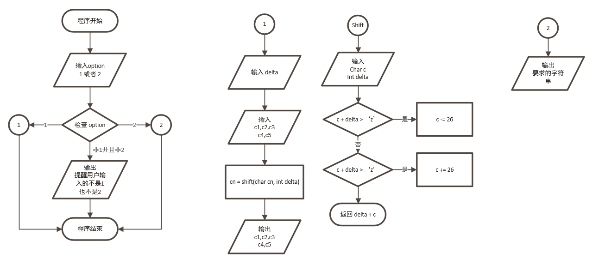

# C 语言实验 2 -  数据类型、运算符合表达式

## （一）实验目的

1. 熟悉C语言数据类型，熟悉如何定义一个整型、字符性和实型的变量，以及对他们赋值得方法。
2. 掌握不同的类型数据之间赋值的规律。
3. 学会使用C的有关算术运算符，以及包含这些运算符的表达式，特别是自加合自减运算符的使用。

## （二）实验内容和要求

### 实验内容1:

要将“china”译成密码，密码规律是：用原来的字母后面第4个字母代替原来的字母。

例如，字母“a”后面第4个字母是“e”，用“e”代替“a”。因此，“china”应译为“glｍre”。

请编一程序，用赋初值的方法使c1、c2、c3、c4、c5五个变量的值分别为‘c’、‘h’、‘i’、‘n’、‘a’，经过运算，使c1、c2、c3、c4、c5分别变为‘g’、‘l’、‘ｍ’、‘r’、‘e’，并输出。

### 实验要求：

1. 输入事先已编好的程序，并运行该程序。分析是否符合要求。
2. 将译码规律修改为：将一个字被它前面第4个字母代替，例如：’E’用’A’代替,’Z’ 用’U’代替,’D’ 用’Z’代替, ‘C’用’Y’代替。修改程序并运行。

### 实验内容2:

运行下面程序，分析其运行结果。

```c
void main() {
    char c1='a',c2='b',c3='c',c4='\101',c5='\116';
    printf("a%c b%c\tc%c\tabc\n",c1,c2,c3);
    printf("\t\b%c %c",c4,c5);
}
```

### 实验要求：

1. 上机前分析程序，写出应得结果。
2. 输入给出程序，并运行该程序。分析运行结果与分析结果是否一样。

## （三） 主要仪器设备

仪器：计算机

实验环境：Windows 10

## （四） 实验原理



## （五） 源程序

见 [main.c](main.c)

## （六） 实验步骤与调试

1. 想出实现移位的逻辑，并写出草稿。
2. 发现了当delta过大时输出为？，查看之后发现`char`的上限只有127，超过之后就会溢出为-127，导致未定义行为。
3. 新增一个变量，映射`(int)`到`char`上面，超过127的数值也不会溢出。
4. 分析项目2的格式化，并推断出输出。

## （七） 实验结果与分析
### 项目1
***
偏移值为4的情况:

输入
```
1
4
```
输出
```
Clang Experiment-2
Choose the programme you want to run (1 or 2):
Task one with shift 4:
Original: c,h,i,n,a
Shifted: g,l,m,r,e
```
***
偏移值为-4的情况:

输入
```
1
-4
```
输出
```
Clang Experiment-2
Choose the programme you want to run (1 or 2):
Task one with shift -4:
Original: c,h,i,n,a
Shifted: y,d,e,j,w
```
***
代码解释
```c
char shift(char c, int delta){
    delta = delta % 26; // 取余数以防输入高于26或者低于-26的数值
    int shifted_int = (int) c + delta; // 为了防止溢出使用int类型
    if (shifted_int > 'z') c -= 26; // 如果字符超过了z就回滚
    if (shifted_int < 'a') c += 26; // 如果字符超过了a就回滚
    return c + delta; // 返回 c + delta
}
```
### 项目2
```c
void main() {
    char c1='a',c2='b',c3='c',c4='\101',c5='\116';
    printf("a%c b%c\tc%c\tabc\n",c1,c2,c3);
    printf("\t\b%c %c",c4,c5);
}
```
1. `c4` 和 `c5` 使用了ASCII代码，分别对应为`A`和`N`
2. 因此 
```c
void main() {
    char c1='a',c2='b',c3='c',c4='A',c5='N';
    printf("a%c b%c\tc%c\tabc\n",c1,c2,c3);
    printf("\t\b%c %c",c4,c5);
}
```
3. 而`\t` 代表 tab ，就是个比较宽的空格。
4. 把`c1, c2, c3`分别带入三个 `%c`中，可知第一个`printf`将输出 `aa bb	cc	abc` 并且换行。
5. `\b`代表退格，也就是删去前一个字符，在这里就是`\t`，并将`c4, c5`带入两个`%c`中，可知第二个`printf`将输出 `A N`。
6. 以下代码将输出一样的结果。
```c
void main() {
    printf("aa bb	cc	abc");
    printf("A N");
}
```
7. 把这段代码输入程序之后确实能够获取期待的结果。

输入
```
2
```
输出
```
Clang Experiment-2
Choose the programme you want to run (1 or 2):
aa bb	cc	abc
A N
```