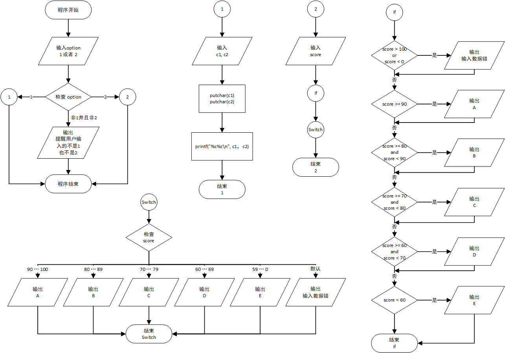

# C 语言实验3 - 简单的C程序

## （一）实验目的
1. 掌握各种类型数据的输入输出的方法，能正确使用各种格式转换符。
2. 学会正确使用逻辑运算符和逻辑表达式。
3.	熟练掌握if语句和switch语句。
4. 结合程序掌握一些简单的算法。


## （二）实验内容和要求
### 实验内容1:
试编写程序，用getchar函数读入两个字符给c1,c2，然后分别用putchar函数和printf函数输出这个字符。

实验要求：
1. 输入事先已编好的程序，并运行该程序。分析运行结果是否正确。  
2. 比较用Printf函数和putchar函数输出字符的特点。


### 实验内容2：
给出一百分制成绩，要求输出成绩等级’A’,’B’,’C’,’D,’E’。90分以上为’A’,80-89分为’B’,70-79分为’C’,60-69分为’D’,60分以下为’E’。　

实验要求：
1. 事先编写好程序，要求分别用if语句和switch语句来实现。 
2. 输入程序，并运行该程序。分析运行结果是否正确。
3. 再运行一次程序，输入分数为负值（如-70），这显然是输入是出错，不应该给出等级，修改程序，使之能正确处理任何数据，当输入数据大于100和小于0时，通知用户“输入数据错”，程序结束。  


## （三）	主要仪器设备
仪器：计算机

实验环境：Windows 10

## （四）	实验原理


## （五）	源程序
见 [main.c](main.c)

## （六） 实验步骤与调试
1. 想逻辑
2. 发现 `getchar()` 很烦，会留下一个换行符在缓存区。然后要是后面再接一个 `getchar()`，之后的`putchar()`就会失效。
3. 使用`while`自建一个缓存，如果获取到的是换行符就跳过。

## （七） 实验结果与分析
### 实验内容1
输入
```
1
a
z
```
输出
```
Clang Experiment - 3
Choose the programme you want to run (1 or 2):
Please enter two characters
Result of putchar():
az
Result of printf():
az
```
1. `putchar();` 只能够输出一个字符，而 `printf();` 可以输出多个字符。
2. 据我的测试，如果只需要一个字符时，`putchar();`比 `printf();` 快一点点。
***
### 实验内容2
输入
```
1
70
```
输出
```
Clang Experiment - 3
Choose the programme you want to run (1 or 2):
Enter your score:
ifImplement:
Your rank:
C
switchImplement:
Your rank:
C
```
***
输入
```
2
114514
```
输出
```
Clang Experiment - 3
Choose the programme you want to run (1 or 2):
Enter your score:
ifImplement:
Invalid score
switchImplement:
Your rank:
Invalid score
```
***
输入
```
2
89
```
输出
```
Clang Experiment - 3
Choose the programme you want to run (1 or 2):
Enter your score:
ifImplement:
Your rank:
B
switchImplement:
Your rank:
B
```
***
1. 在输入错误输入(114514)的时候，程序返回了`Invalid score`。
2. 在输入边界值时程序也能够正确返回等级。
3. if 和 switch 的实现均返回相同的值。